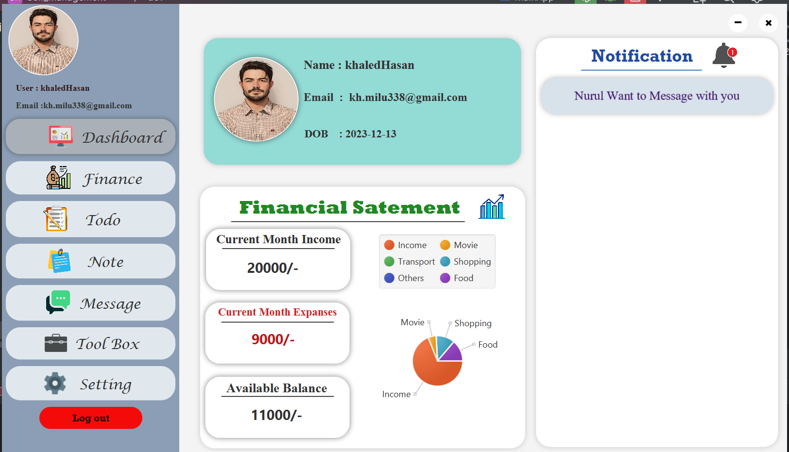
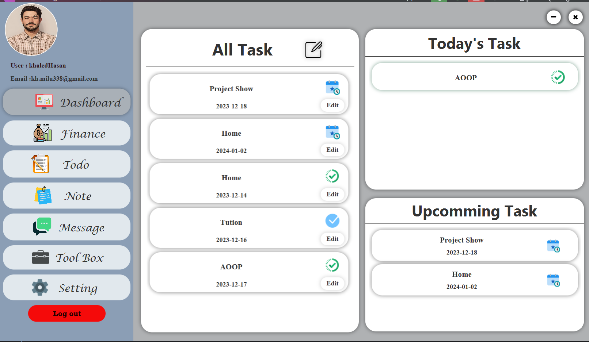
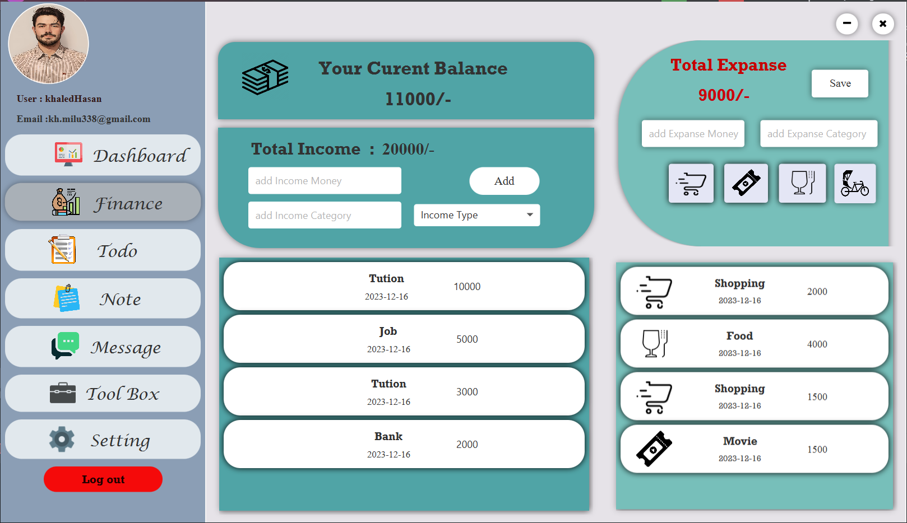
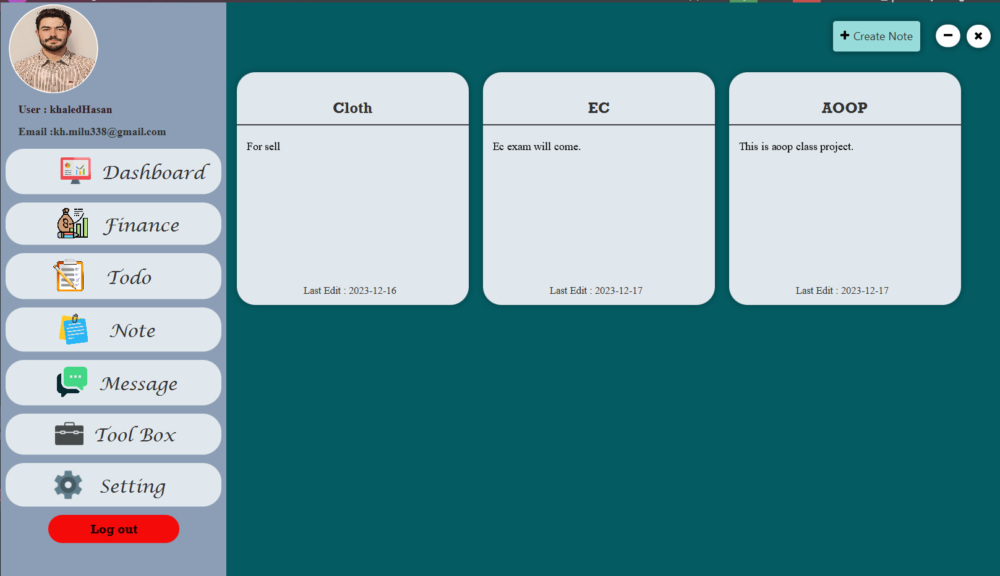
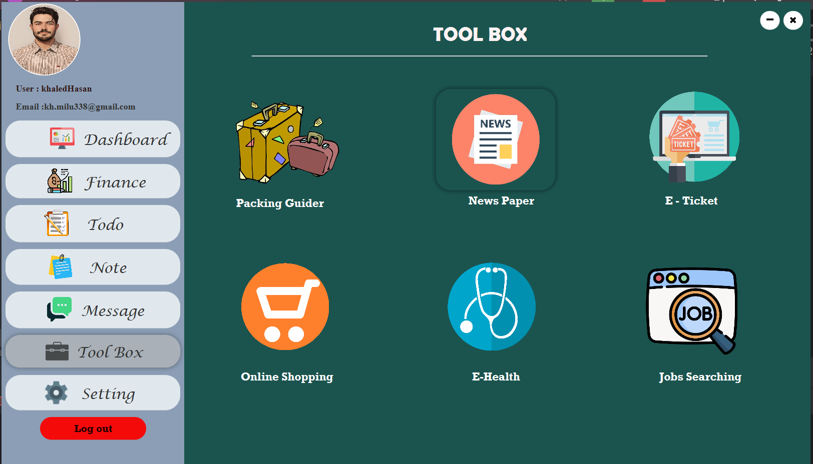
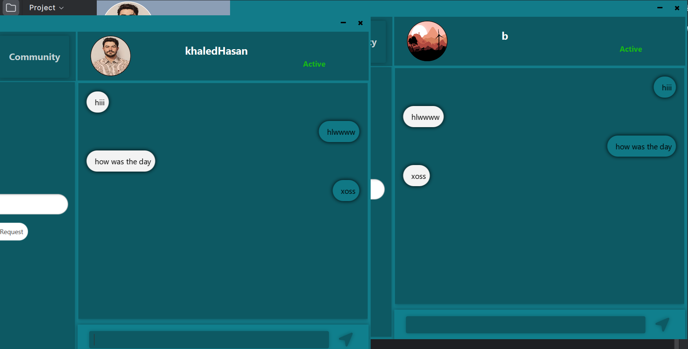

# Self Management

[](LICENSE)
[](https://www.oracle.com/java/technologies/javase-jdk11-downloads.html)

## Overview

Self Management is a Java-based project designed to help individuals manage and organize various aspects of their lives effectively. Whether it's task management, goal setting, or habit tracking, this project provides a flexible and customizable platform for self-management.

## Features🧿
- **DashBoard**:
    <br><br> 
    <br/>
- **Task Management**: Keep track of your tasks, prioritize them, and mark them as completed.
    <br><br> 
    <br/>
- **Finance Mangement**:
 <br><br> 
    <br/>
- **Create Note**: 
 <br><br> 
    <br/>
- **ToolBox**:
 <br><br> 
    <br/>
- **Messaging**:
 <br><br> 
    <br/>
    
### Prerequisites

- Java Development Kit (JDK) 11 or later
- Maven (for building and managing dependencies)
### Build and Run

1. Clone the repository:

   ```bash
   git clone https://github.com/your-username/self-management.git
2. Navigate to the project directory:
   ```bash
     cd self-management
   ```
3. Build the project using Maven:

```bash
     mvn clean install
```
4. Run the application:
```bash
    java -jar target/self-management.jar
```

## License
This project is licensed under the MIT License - see the LICENSE file for details.

## Acknowledgments
Special thanks to contributors who have participated in this project.
Feel free to reach out if you have any questions or issues. Happy self-managing!

## Contributors

Thanks to the following people who have contributed to this project:

- [Khaled Hasan Milu](https://github.com/khaledhasanmilu)
- [Nurul Huda Arosh](https://github.com/nurul5801)


